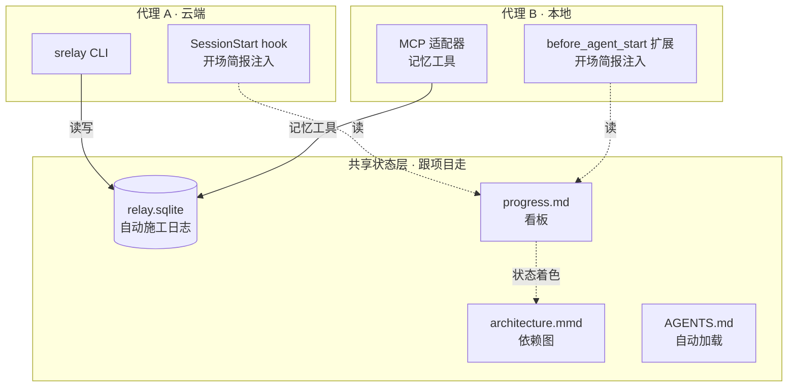

# Agent State Stack（跨 AI 编码代理的共享状态栈）

让多个 AI 编码代理（默认适配 **ZCode** 与 **pi**）在同一批项目上**共享状态**：新会话开场自动注入项目简报、施工进度看板、模块依赖图、驾驶舱面板——状态存文件与本地 SQLite，跟项目走，不跟工具走，零云端账号。

> 设计哲学：**状态不是事后回忆写出来的，是干活时随手记出来的；而"记"这件事由框架层强制完成，不靠模型自觉。**

## 为什么

多代理混用工作流的三大痛点：

1. **交接失真**：靠人写交接文档，模型容易漏；上下文压缩还会物理删除旧消息
2. **工具割裂**：云端代理定的方案，本地代理不知道；换一个工具就失忆
3. **token 爆炸**：预填充大量历史不如按需注入一页简报

本仓库给出一个被两轮红队审计过的最小实现：



## 四层结构

| 层 | 载体 | 谁更新 |
|---|---|---|
| L1 原文层 | [SessionRelay](https://github.com/EwanJasper/SessionRelay) relay.sqlite（守护 30 秒自动捕获会话原文+决策，带出处） | 框架自动 |
| L2 提炼层 | `progress.md` 看板（模块 ✅🔄⛔ 状态行） | AI 干活顺手改一行 |
| L3 地图层 | `architecture.mmd` 依赖图（节点着色=状态）+ `dashboard.html` 面板 | 生成器+AI |
| L4 注入层 | 本仓库：ZCode SessionStart hook / pi before_agent_start 扩展 | 框架自动 |

## 安装

### 前置

```bash
npm install -g @ewanjasper/sessionrelay   # 记忆层（Node ≥ 22）
cd 你的项目 && srelay init --yes           # 初始化 + 回填近 30 天会话
```

### ① ZCode：开场简报 hook

把 `hook/statebrief.mjs` 放到任意固定位置，在 `~/.zcode/cli/config.json` 顶层加：

```json
"hooks": {
  "enabled": true,
  "events": {
    "SessionStart": [
      { "hooks": [ { "type": "process", "command": "<node 绝对路径>",
        "args": ["<statebrief.mjs 绝对路径>"], "timeoutMs": 20000 } ] }
    ]
  }
}
```

### ② pi：开场简报扩展

把 `pi-extension/state-brief.ts` 放进 `~/.pi/agent/extensions/`，改文件顶部两行常量（NODE / SRELAY）即可。pi 会在每次 `before_agent_start` 自动注入同一份简报（本地小模型也无需自觉）。

### ③ 面板生成器

```bash
node scripts/gen_dashboard.mjs <项目根>    # progress.md + architecture.mmd → dashboard.html
```

### ④ 项目内起看板

复制 `templates/progress.md` 与 `templates/architecture.mmd` 到项目根，按模块填写。

## 口令（写入双侧 AGENTS.md 的约定）

| 口令 | 含义 |
|---|---|
| **继续** | 按简报+看板续作原任务 |
| **看板** | 渲染看板与依赖图 |
| **接入** | 老项目一键上栈（srelay init → 生成看板与依赖图） |

**注入 ≠ 强制续作**——简报只是让代理"知道现状"，用户的下一句话才是指令。

## 已知边界与运维

见 [docs/ops.md](docs/ops.md)：故障排查表、稳定性设计、Windows 自启链注意点、回归清单。

## 致谢

- [SessionRelay](https://github.com/EwanJasper/SessionRelay)（@EwanJasper）——本栈的记忆底座，中文检索/零外呼/HOP 交接协议
- [pi coding agent](https://github.com/earendil-works/pi)——扩展系统与 `--mode rpc`
- 上游问题反馈：[SessionRelay#1](https://github.com/EwanJasper/SessionRelay/issues/1)（Windows 守护脚本路径转义）

## License

MIT
